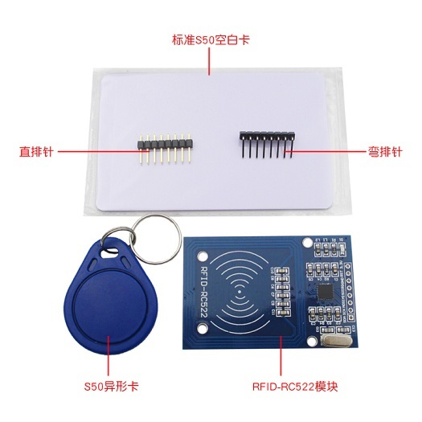
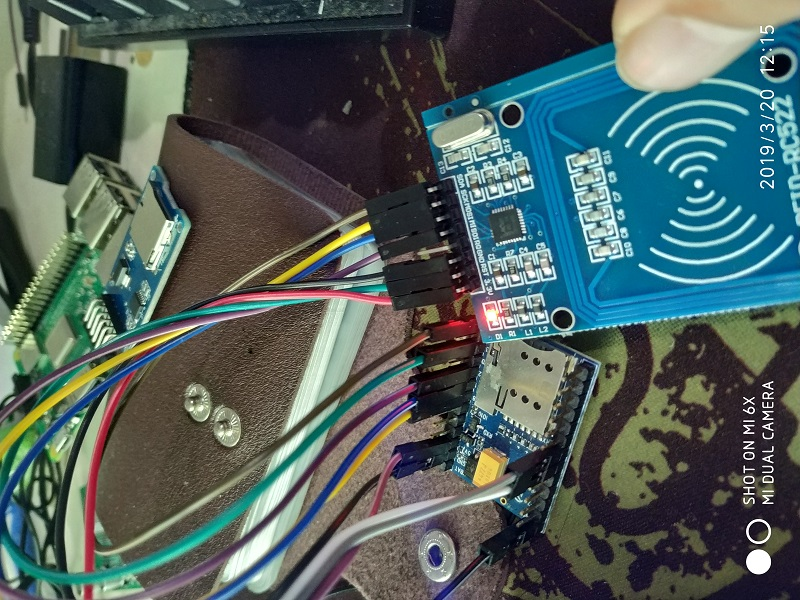
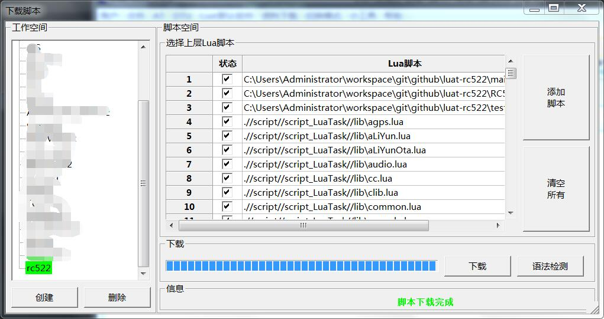
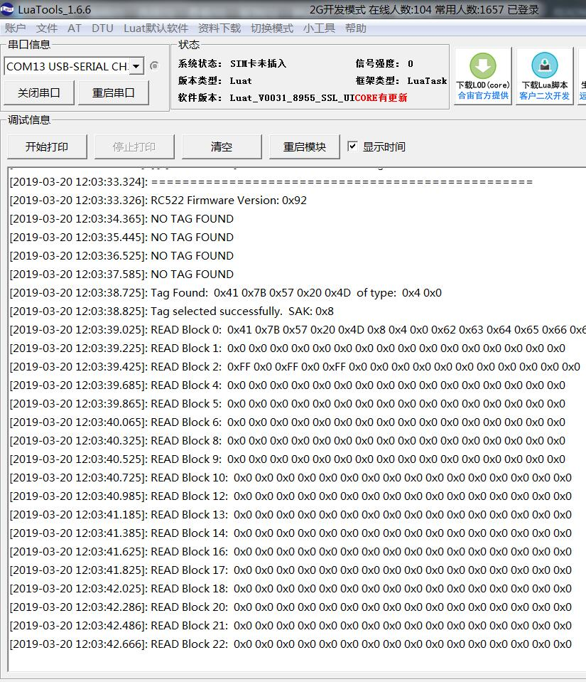
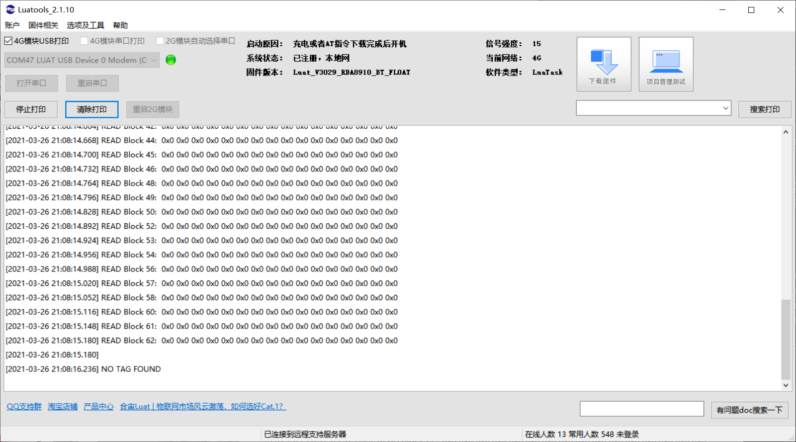

# Luat-RC522

原仓库： https://gitee.com/wendal/luat-rc522

​				https://gitee.com/dreamcmi/luat-rc522

#### 介绍

合宙Luat读写RC522

本程序修改自 https://github.com/capella-ben/LUA_RC522

关系如下

```
-- This is a port of:
--   https://github.com/ondryaso/pi-rc522        -> Python
--   https://github.com/ljos/MFRC522             -> Arduino
--   https://github.com/capella-ben/LUA_RC522    -> ESP8266 by Ben Jackson
```

#### 软件架构

* 何为Luat, 请查阅 http://wiki.openluat.com/

* 何为RC522 IC卡/门禁卡的读取模块

* 何为Air202/Air720/Air724 合宙出品的GSM通信模块

  
  
   图片来源 https://blog.csdn.net/Leytton/article/details/73480974

## Air202使用说明

#### 接线要求

| Color | RC522 | Air202 S6 | func          |
| ----- | ----- | --------- | ------------- |
| 绿    | RST   | GPIO 3    | reset         |
| 红    | 3.3v  | -         | 额外3.3v供电  |
| 黑    | GND   | GND       | 与电源共地    |
| 紫    | MISO  | SPI_DI    | rc522->air202 |
| 蓝    | MOSI  | SPI_DO    | air202->rc522 |
| 黄    | SCK   | SPI_CLK   | SPI 时钟      |
| 棕    | SDA   | GPIO 2    | SPI 片选      |



注意: 供电必须是3.3v!注意共地!!否则不稳!!

#### 文件说明

RC522.lua -- 驱动程序  
test.lua  -- 测试程序  
main.lua  -- demo的入口  

#### 使用截图





## Air724使用说明

#### 接线要求

| RC522 | Air724   | func                               |
| ----- | -------- | ---------------------------------- |
| RST   | GPIO 18  | reset                              |
| 3.3v  | VMMC     | 额外3.3v供电（借用vmmc的3.3v供电） |
| GND   | GND      | 与电源共地                         |
| MISO  | SPI_MISO | rc522->air724                      |
| MOSI  | SPI_MOSI | air724->rc522                      |
| SCK   | SPI_CLK  | SPI 时钟                           |
| SDA   | GPIO 19  | SPI 片选                           |

注意: 供电必须是3.3v!注意共地!!否则不稳!!

#### 文件说明

RC522.lua -- 驱动程序  
test.lua  -- 测试程序  
main.lua  -- demo的入口  

#### 使用截图



## Air302使用说明

#### 接线要求

| RC522 | Air302   | func          |
| ----- | -------- | ------------- |
| RST   | GPIO 7   | reset         |
| 3.3v  | -        | 额外3.3v供电  |
| GND   | GND      | 与电源共地    |
| MISO  | SPI_MISO | rc522->air302 |
| MOSI  | SPI_MOSI | air302->rc522 |
| SCK   | SPI_CLK  | SPI 时钟      |
| SDA   | GPIO 9   | SPI 片选      |

注意: 供电必须是3.3v!注意共地!!否则不稳!!

#### 文件说明

RC522.lua -- 驱动程序  
main.lua  -- demo的入口  

#### 使用说明

LuatOS仓库：https://gitee.com/openLuat/LuatOS